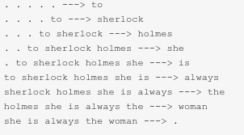

# 🧠 Next Word Predictor: Interactive Language Modeling with PyTorch

[](https://next-word-predictor-lcl1.onrender.com)
[](https://www.python.org/)
[](https://pytorch.org/)
[](https://streamlit.io/)
[](https://opensource.org/licenses/MIT)

An interactive **PyTorch-based Next Word Prediction** application that generates natural language one word at a time using pretrained **Multi-Layer Perceptron (MLP)** language models.

The project provides a modern **Streamlit interface** where users can experiment with multiple pretrained models, adjust inference hyperparameters, and observe how different configurations affect generated text.

---

# 🌐 Live Demo

👉 **Try it here:**  
https://movie-recommendation-system-final.onrender.com

No installation required.

---

# 📸 Application Preview


---

# 🚀 Overview

This project demonstrates how classical neural language models can learn contextual word relationships from large text corpora.

The application allows users to:

- Predict multiple future words
- Compare different pretrained models
- Experiment with context length
- Change embedding dimensions
- Select activation functions
- Adjust temperature sampling
- Compare different random initializations

<p align="center">
  
</p>

Instead of using Transformers or LSTMs, this project implements an efficient **feed-forward neural language model (MLP)** that predicts the next word using a fixed-length context window.

---

# ✨ Features

## 📝 Interactive Streamlit Interface

- Clean responsive UI
- Instant text generation
- Real-time predictions
- Dark theme interface

---

## 🤖 Multiple Pretrained Models

The application includes **16 pretrained PyTorch models** trained using different hyperparameter combinations.

Each model differs in:

- Context Length
- Embedding Dimension
- Activation Function
- Random Seed

The appropriate model is automatically loaded according to the user's selections.

---

## 🎛 Adjustable Hyperparameters

Users can modify:

- Context Length
- Embedding Dimension
- Activation Function
- Random Seed
- Temperature
- Number of Words to Predict

without retraining the model.

---

## 🌡 Temperature Sampling

Temperature controls prediction randomness.

| Temperature | Behaviour |
|-------------|-----------|
| **0.2** | Highly deterministic |
| **0.5** | Conservative predictions |
| **1.0** | Balanced generation |
| **1.5** | More creative |
| **2.0+** | Highly random |

---

## ⚡ Fast Inference

Since all models are pretrained, predictions are generated in real time without additional training.

---

# 🧠 How the Model Works

The prediction pipeline is:

```
Input Text
      │
      ▼
Text Cleaning
      │
      ▼
Tokenization
      │
      ▼
Vocabulary Encoding
      │
      ▼
Extract Last N Words
      │
      ▼
Embedding Layer
      │
      ▼
Hidden Layer (MLP)
      │
      ▼
Output Layer
      │
      ▼
Softmax
      │
      ▼
Predicted Word
      │
      ▼
Append Word
      │
      ▼
Repeat
```

---

# ⚙ Model Architecture

The language model is a feed-forward neural network consisting of:

- Embedding Layer
- Hidden Linear Layer
- Activation Function
- Output Linear Layer
- Softmax Prediction

Unlike recurrent models, the network predicts the next word using a **fixed context window**.

---

# 🔄 Prediction Pipeline

```
User Input
      │
      ▼
Preprocessing
      │
      ▼
Load Selected Model
      │
      ▼
Forward Pass
      │
      ▼
Temperature Scaling
      │
      ▼
Word Sampling
      │
      ▼
Append Prediction
      │
      ▼
Repeat Until Desired Length
```

---

# 📚 Dataset

The models were trained using:

**Leo Tolstoy — War and Peace**

The text undergoes preprocessing including:

- Lowercasing
- Punctuation cleaning
- Tokenization
- Vocabulary construction
- Context-target pair generation

before being used for training.

---

# 🏋 Training Pipeline

```
War and Peace
        │
        ▼
Text Cleaning
        │
        ▼
Tokenization
        │
        ▼
Vocabulary Creation
        │
        ▼
Context-Target Generation
        │
        ▼
MLP Training
        │
        ▼
16 Pretrained Models
        │
        ▼
Streamlit Application
```

---

# 📊 Training Configuration

| Property | Value |
|-----------|---------|
| Framework | PyTorch |
| Model | Feed Forward Neural Network (MLP) |
| Dataset | War and Peace |
| Number of Models | 16 |
| Embedding Dimensions | Multiple |
| Context Lengths | Multiple |
| Activation Functions | ReLU / Tanh |
| Random Seeds | Multiple |

---

# 🎛 Model Variants

The repository contains **16 pretrained models**.

Each `.pth` file represents a different combination of:

- Context Length
- Embedding Size
- Activation Function
- Random Initialization

During inference, the application automatically selects the correct model according to the dropdown options in the interface.

---

# 📁 Project Structure

```
Next-Word-Predictor/

│── assets/
│   ├── App-Icon.png
│   ├── help_icon.svg
│   ├── example_dataset.png
│   └── leo-tolstoy-war-and-peace.txt
│
│── model_variants/
│   ├── model_variant_1.pth
│   ├── ...
│   └── model_variant_16.pth
│
│── app.py
│── model_utils.py
│── word-predictor.ipynb
│── requirements.txt
│── README.md
```

---

# 🛠 Tech Stack

### Machine Learning

- PyTorch
- NumPy
- Scikit-learn

### Data Processing

- Pandas

### Frontend

- Streamlit

### Visualization

- Matplotlib

### Image Processing

- Pillow

---

# 🚀 Installation

Clone the repository

```bash
git clone https://github.com/KshitijKasodkar/Next-Word-Predictor.git

cd Next-Word-Predictor
```

Create a virtual environment

```bash
python -m venv .venv
```

Activate it

### Windows

```bash
.venv\Scripts\activate
```

### Linux / WSL

```bash
source .venv/bin/activate
```

Install dependencies

```bash
pip install -r requirements.txt
```

Run the application

```bash
streamlit run app.py
```

---

# 📈 Future Improvements

- Transformer-based Language Model
- LSTM / GRU comparison
- Beam Search
- Top-k Sampling
- Top-p Sampling
- Attention Mechanism
- HuggingFace Integration
- ONNX Quantized Models
- GPU Optimizations
- Larger Training Corpus

---

# 📖 References

- PyTorch Documentation
- Streamlit Documentation
- Neural Probabilistic Language Models
- Bengio et al. (2003)
- Leo Tolstoy — War and Peace

---

# 📄 License

This project is licensed under the **MIT License**.

---

# 👨‍💻 Author

**Kshitij Kasodkar**

B.Tech

Dual Major in Material Engineering and Computer Science Engineering

Indian Institute of Technology Gandhinagar

GitHub:
https://github.com/KshitijKasodkar

---

